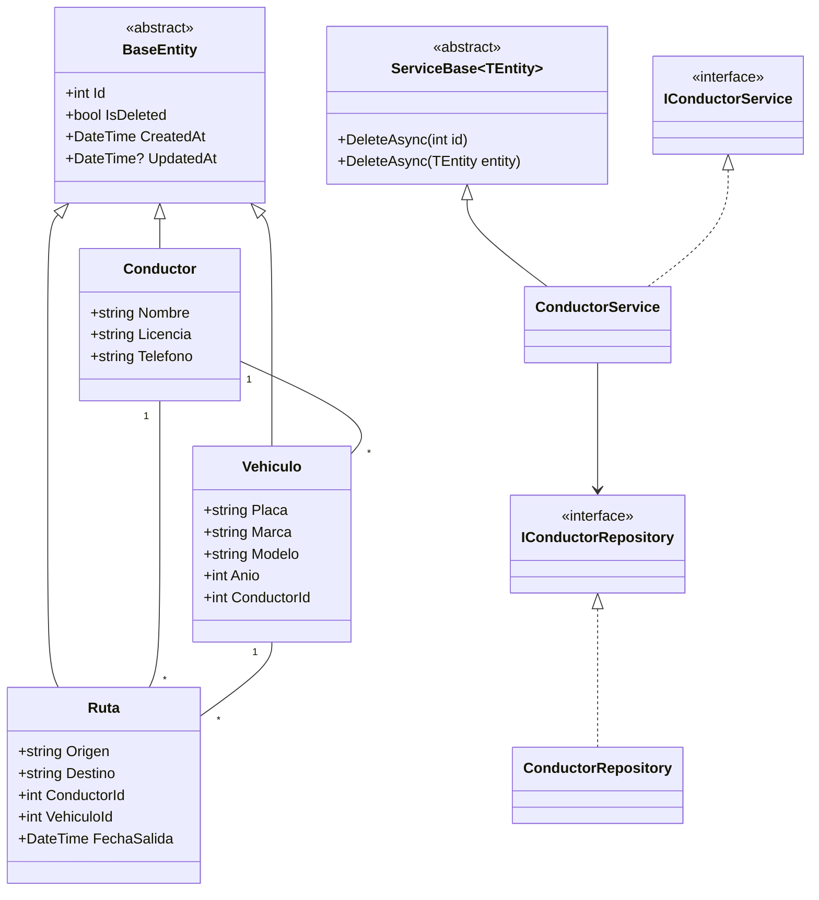

# TransportTrack - Presentación del Sistema

## Sistema de Gestión de Flotas de Transporte

**Curso:** Programación Orientada a Objetos (POO)
**Proyecto Final:** TransportTrack
**Tecnologías:** .NET 10 · React 19 · TypeScript · SQLite · Vite

---

## 1. Idea del Proyecto

**TransportTrack** es un sistema web de gestión de flotas que permite a una empresa de transporte administrar de forma centralizada tres recursos fundamentales:

| Recurso | Descripción |
|---------|-------------|
| **Conductores** | Personal autorizado con licencia y teléfono de contacto |
| **Vehículos** | Unidades de transporte con placa, marca, modelo y año |
| **Rutas** | Recorridos que vinculan un conductor y un vehículo entre un origen y un destino |

### Principales Funcionalidades
- CRUD completo de conductores, vehículos y rutas
- Dashboard con estadísticas en tiempo real
- Validaciones de negocio (licencia/placa únicas, integridad referencial)
- Arquitectura distribuida con separación de capas
- Frontend moderno y responsive

### Objetivos
1. Centralizar la información operativa de la flota
2. Garantizar la integridad de los datos mediante validaciones
3. Proporcionar una interfaz amigable y accesible
4. Demostrar la aplicación de conceptos de POO en un sistema real

---

## 2. Diseño Preliminar del Sistema

### Arquitectura por Capas

```
┌─────────────────────────────────────────┐
│       FRONTEND (React + TypeScript)     │  ← Capa de Presentación
└───────────────────┬─────────────────────┘
                    │ HTTP/REST (JSON)
┌───────────────────▼─────────────────────┐
│       API (ASP.NET Core Controllers)    │  ← Capa de Presentación API
└───────────────────┬─────────────────────┘
┌───────────────────▼─────────────────────┐
│       APPLICATION (Servicios)           │  ← Capa de Lógica de Negocio
└───────────────────┬─────────────────────┘
┌───────────────────▼─────────────────────┐
│       INFRASTRUCTURE (Repositorios)     │  ← Capa de Acceso a Datos
└───────────────────┬─────────────────────┘
┌───────────────────▼─────────────────────┐
│       DOMAIN (Entidades)                │  ← Capa de Dominio
└───────────────────┬─────────────────────┘
┌───────────────────▼─────────────────────┐
│       DATABASE (SQLite)                 │  ← Persistencia
└─────────────────────────────────────────┘
```

### Diagrama de Clases Resumido



---

## 3. Implementación de Conceptos POO

### 3.1 Clases Normales

Entidades del dominio con atributos y métodos para representar la información:

```csharp
public class Conductor : BaseEntity
{
    public string Nombre { get; set; } = string.Empty;
    public string Licencia { get; set; } = string.Empty;
    public string Telefono { get; set; } = string.Empty;
    public ICollection<Vehiculo> Vehiculos { get; set; } = new List<Vehiculo>();
}
```

### 3.2 Constructores

Todas las entidades definen **tres constructores**:

| Constructor | Uso |
|-------------|-----|
| `Conductor()` | Inicialización por defecto (Entity Framework) |
| `Conductor(nombre, licencia, telefono)` | Creación desde servicios/UI |
| `Conductor(id, nombre, licencia, telefono, createdAt, isDeleted)` | Hidratación desde base de datos |

```csharp
public Conductor(string nombre, string licencia, string telefono = "") : base()
{
    Nombre = nombre;
    Licencia = licencia;
    Telefono = telefono;
}
```

### 3.3 Clases Abstractas

El sistema define **tres clases abstractas** en distintas capas:

#### a) `BaseEntity` (Capa de Dominio)
```csharp
public abstract class BaseEntity
{
    public int Id { get; set; }
    public bool IsDeleted { get; set; }
    public DateTime CreatedAt { get; set; }
    public DateTime? UpdatedAt { get; set; }

    protected BaseEntity() { CreatedAt = DateTime.Now; }
    protected BaseEntity(DateTime createdAt) { CreatedAt = createdAt; }
}
```

#### b) `BaseRepository<T>` (Capa de Infraestructura)
CRUD genérico con soft delete:
```csharp
public class BaseRepository<TEntity> where TEntity : BaseEntity
{
    public virtual async Task<List<TEntity>> GetAllAsync() { ... }
    public virtual async Task<TEntity?> GetByIdAsync(int id) { ... }
    public virtual async Task AddAsync(TEntity entity) { ... }
    public virtual async Task DeleteAsync(TEntity entity) { ... }
}
```

#### c) `ServiceBase<T>` (Capa de Aplicación)
```csharp
public abstract class ServiceBase<TEntity> where TEntity : BaseEntity
{
    protected readonly BaseRepository<TEntity> Repository;

    protected ServiceBase(BaseRepository<TEntity> repository)
    {
        Repository = repository;
    }
}
```

### 3.4 Sobrecarga de Métodos (Overloading)

La clase abstracta `ServiceBase<T>` demuestra **sobrecarga de métodos**:

```csharp
// SOBRECARGA 1: eliminar por ID
public virtual async Task DeleteAsync(int id)
{
    var entity = await GetByIdAsync(id);
    if (entity is null) return;
    await Repository.DeleteAsync(entity);
}

// SOBRECARGA 2: eliminar por entidad
public virtual async Task DeleteAsync(TEntity entity)
{
    await Repository.DeleteAsync(entity);
}
```

**¿Por qué es útil?** Permite a los controladores/llamadores elegir la forma más conveniente:
- `await service.DeleteAsync(5)` → elimina el registro con ID 5
- `await service.DeleteAsync(entity)` → elimina una entidad ya cargada en memoria

### 3.5 Herencia y Polimorfismo

| Patrón | Implementación |
|--------|----------------|
| **Herencia de entidades** | `Conductor`, `Vehiculo`, `Ruta` heredan de `BaseEntity` |
| **Herencia de repositorios** | Repositorios concretos heredan de `BaseRepository<T>` |
| **Herencia de servicios** | Servicios concretos heredan de `ServiceBase<T>` |
| **Interfaces (polimorfismo)** | Controladores dependen de interfaces, no de implementaciones |
| **Override (polimorfismo)** | `VehiculoRepository` sobreescribe `GetAllAsync()` para incluir `Conductor` |

```csharp
// Controlador depende de la INTERFAZ (inversión de dependencias)
private readonly IConductorService _conductorService;

public ConductoresController(IConductorService conductorService)
{
    _conductorService = conductorService;
}
```

### 3.6 Encapsulamiento

- Propiedades privadas en servicios: `_conductorRepository`
- Soft delete interno: el llamador no puede borrar físicamente
- Validaciones con Data Annotations
- DTOs aíslan la representación externa de las entidades

---

## 4. Funcionamiento del Sistema

### 4.1 Flujo de Datos (Ejemplo: Crear Conductor)

```
┌─────────┐    POST /api/conductores     ┌─────────────┐
│ React   │ ───────────────────────────► │ Controller  │
│ (Modal) │                              └─────┬───────┘
└─────────┘                                   │
                                              ▼
                                     ┌───────────────┐
                                     │ Service       │  Valida licencia única
                                     │ CreateAsync() │  + lógica de negocio
                                     └─────┬─────────┘
                                           ▼
                                     ┌───────────────┐
                                     │ Repository    │  EF Core: INSERT
                                     │ AddAsync()    │
                                     └─────┬─────────┘
                                           ▼
                                     ┌───────────────┐
                                     │ SQLite        │
                                     └───────────────┘
```

### 4.2 Pantallas del Frontend

| Pantalla | Contenido |
|----------|-----------|
| **Dashboard** | 3 tarjetas con contadores + tablas de todas las entidades |
| **Conductores** | Tabla CRUD con modal de formulario |
| **Vehículos** | Tabla CRUD con dropdown de conductor |
| **Rutas** | Tabla CRUD con dropdowns de conductor y vehículo |

---

## 5. Arquitectura Distribuida

El sistema sigue una **arquitectura distribuida** donde cada componente es un artefacto desplegable independiente:

| Componente | Tecnología | Despliegue |
|------------|-----------|------------|
| **Frontend** | React + Vite | Netlify (CDN estático) |
| **API Backend** | ASP.NET Core 8 | Servidor propio / contenedor |
| **Base de Datos** | SQLite | Archivo local / servidor |

```
┌────────────────────┐         ┌────────────────────┐
│   Netlify CDN      │  HTTP   │   API Server       │
│   React SPA        │ ──────► │   .NET 10 + EF Core │
│   (estático)       │  JSON   │                    │
└────────────────────┘         └─────────┬──────────┘
                                         │ SQLite
                                         ▼
                                  ┌──────────────┐
                                  │   Base de    │
                                  │   Datos      │
                                  └──────────────┘
```

**Ventajas:**
- Escalabilidad independiente de cada capa
- Frontend servido desde CDN global (Netlify)
- API puede escalar horizontalmente
- Sustitución de SQLite por SQL Server/PostgreSQL sin cambios en el frontend

---

## 6. Tecnologías Utilizadas

| Capa | Tecnología |
|------|-----------|
| Frontend | React 19, TypeScript, Vite, Axios |
| Backend | .NET 10, ASP.NET Core Web API |
| ORM | Entity Framework Core 10 |
| Base de Datos | SQLite |
| Documentación API | Swagger / OpenAPI |
| Control de Versiones | Git + GitHub |
| Despliegue Frontend | Netlify |

---

## 7. Demostración del Sistema

### 7.1 Requisitos de Ejecución
- .NET 10 SDK o superior
- Node.js 18+
- npm

### 7.2 Ejecutar Backend
```bash
cd TransportTrack.Api
dotnet run
# http://localhost:5000 | Swagger: /swagger
```

### 7.3 Ejecutar Frontend
```bash
cd TransportTrack.Web
npm install
npm run dev
# http://localhost:5173
```

### 7.4 Desplegar Frontend en Netlify
```bash
cd TransportTrack.Web
npm run build
# Arrastrar carpeta "dist" a Netlify o conectar repo GitHub
```

---

## 8. Conclusiones

1. **POO aplicada en la práctica:** El proyecto demuestra todos los pilares de la POO (herencia, encapsulamiento, polimorfismo y abstracción) en un sistema funcional y real.

2. **Arquitectura profesional:** La separación en capas (Domain, Infrastructure, Application, API, Frontend) facilita el mantenimiento, testing y evolución del sistema.

3. **Validación de negocio:** Las reglas de negocio están centralizadas en la capa de servicios, no dispersas en la interfaz.

4. **Escalabilidad:** La arquitectura distribuida permite desplegar el frontend y el backend de forma independiente.

5. **Tecnologías actuales:** .NET 10 y React 19 son tecnologías modernas, mantenidas activamente y demandadas en la industria.

---

## 9. Preguntas y Respuestas (Q&A)

**¿Por qué SQLite?**
Permite una implementación sin servidor de base de datos, fácil de configurar y portar. Por el patrón repositorio, es transparente migrar a SQL Server o PostgreSQL.

**¿Qué pasa si dos conductores usan la misma licencia?**
La capa de servicios lo detecta y retorna error 400. Además, el índice único en la base de datos lo previene a nivel de BD.

**¿Se puede eliminar un conductor con vehículos?**
No. La regla de negocio en el repositorio valida que no tenga vehículos activos antes de permitir el borrado lógico.

---

**¡Gracias por su atención!**